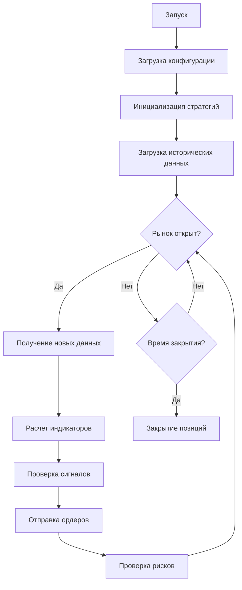
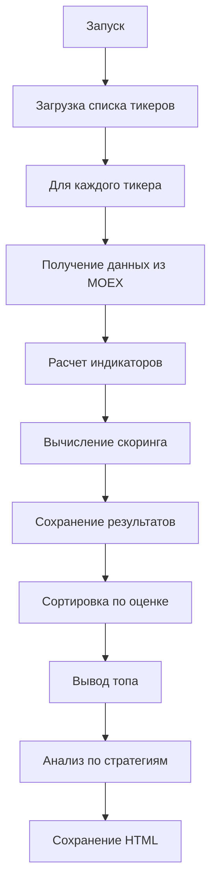

# 📚 Полная документация проекта Hello Algo

## 📋 Содержание
1. [Общее описание](#общее-описание)
2. [Архитектура проекта](#архитектура-проекта)
3. [Установка и настройка](#установка-и-настройка)
4. [Модуль main.py - Торговый бот](#модуль-mainpy---торговый-бот)
5. [Модуль top_stocks.py - Анализ акций](#модуль-top_stockspy---анализ-акций)
6. [Конфигурационные файлы](#конфигурационные-файлы)
7. [Торговые стратегии](#торговые-стратегии)
8. [Технические индикаторы](#технические-индикаторы)
9. [API и работа с данными](#api-и-работа-с-данными)
10. [Примеры использования](#примеры-использования)
11. [Устранение неполадок](#устранение-неполадок)

---

## 📖 Общее описание

**Hello Algo** — это модульная платформа для алгоритмической торговли на российском фондовом рынке (MOEX). Проект состоит из двух основных компонентов:

1. **Торговый бот (`main.py`)** — автоматическая торговля по заданным стратегиям через платформу arenago.ru
2. **Анализатор акций (`top_stocks.py`)** — скрининг рынка для поиска перспективных инструментов

### 🎯 Ключевые возможности

- **Мультиинструментальная торговля** — одновременно несколько акций
- **Несколько стратегий** — SMA Crossover, RSI Mean Reversion, Pair Trading
- **Управление рисками** — стоп-лоссы, лимиты позиций, контроль дневных сделок
- **Анализ рынка** — скрининг акций, поиск лучших для покупки
- **Подбор под стратегии** — какие акции подходят для каждой стратегии
- **Детальное логирование** — все действия записываются для анализа

---

## 🏗 Архитектура проекта

```
hello_algo/
│
├── config/                          # Конфигурация
│   ├── venue_config.py              # Настройки подключения к arenago.ru
│   ├── trading_config.py            # Технические настройки торговли
│   └── algo_params.py               # Параметры стратегий
│
├── data/                            # Работа с данными
│   └── moex_client.py               # Клиент MOEX API
│
├── indicators/                       # Технические индикаторы
│   ├── __init__.py
│   └── technical.py                  # SMA, EMA, RSI, ATR, Bollinger, MACD
│
├── strategies/                       # Торговые стратегии
│   ├── __init__.py
│   ├── base_strategy.py              # Базовый класс
│   ├── sma_crossover.py              # Стратегия на скользящих средних
│   ├── rsi_mean_reversion.py         # Стратегия на RSI
│   └── pair_trading.py               # Парный трейдинг
│
├── execution/                        # Исполнение ордеров
│   └── order_manager.py              # Отправка на arenago.ru
│
├── core/                              # Ядро системы
│   ├── trading_engine.py              # Главный движок
│   ├── portfolio.py                    # Управление портфелем
│   └── risk_manager.py                 # Управление рисками
│
├── screener/                          # Анализ акций
│   ├── __init__.py
│   ├── stock_screener.py              # Скрининг акций
│   ├── strategy_matcher.py            # Подбор под стратегии
│   ├── ranker.py                       # Ранжирование
│   └── reporters.py                    # Отчеты
│
├── utils/                             # Утилиты
│   ├── time_utils.py                   # Работа со временем
│   ├── logger.py                        # Логирование
│   └── validators.py                    # Валидация
│
├── main.py                            # Торговый бот
├── top_stocks.py                      # Анализатор акций
├── requirements.txt                    # Зависимости
└── README.md                           # Документация
```

---

## 🚀 Установка и настройка

### 1. Клонирование репозитория
```bash
git clone https://github.com/algopolygon/hello_algo.git
cd hello_algo
```

### 2. Установка зависимостей
```bash
pip install -r requirements.txt
```

### 3. Настройка конфигурации

**Файл `config/venue_config.py`:**
```python
# Настройки подключения к платформе arenago.ru
ARENAGO_CONFIG = {
    'url': 'https://arenago.ru',
    'token': 'ваш_токен',  # Получите на arenago.ru
    'bot': 'имя_бота'       # Создайте бота на платформе
}
```

**Файл `config/trading_config.py`:**
```python
TRADING_CONFIG = {
    'tickers': ['GAZP', 'SBER', 'LKOH'],  # Какие акции торгуем
    'quantities': {
        'GAZP': 700,    # Количество лотов
        'SBER': 1000,
        'LKOH': 50
    },
    'trading_start_time': '07:05:00',
    'trading_end_time': '23:40:00',
    'history_days': 3,
    'fetch_interval': 60,
    'max_daily_trades': 200
}
```

### 4. Проверка установки
```bash
python top_stocks.py --top 5
```

---

## 🤖 Модуль main.py - Торговый бот

### Назначение
Автоматическая торговля по заданным стратегиям в реальном времени.

### Запуск
```bash
python main.py
```

### Алгоритм работы



### Параметры командной строки
`main.py` не принимает параметров - все настройки в конфигах.

### Логика работы

1. **Инициализация** (при запуске)
   - Загружает настройки из `trading_config.py`
   - Создает экземпляры стратегий для каждого тикера
   - Загружает исторические данные за `history_days`

2. **Основной цикл** (каждые `fetch_interval` секунд)
   - Получает актуальные цены по всем инструментам
   - Для каждой стратегии проверяет сигналы
   - При сигнале отправляет ордер через `OrderManager`
   - Проверяет стоп-лоссы и лимиты

3. **Завершение дня** (в `trading_end_time`)
   - Закрывает все открытые позиции
   - Сохраняет статистику
   - Завершает работу

### Пример лога работы
```
2026-02-25 10:00:00 - trading_bot - INFO - Запуск Trading Engine...
2026-02-25 10:00:01 - trading_bot - INFO - Создана стратегия SMA Crossover для GAZP
2026-02-25 10:00:02 - trading_bot - INFO - Загружена история для GAZP: 150 свечей
2026-02-25 10:00:03 - trading_bot - INFO - Trading Engine запущен
2026-02-25 10:01:00 - trading_bot - INFO - SMA Crossover_GAZP: Сигнал BUY
2026-02-25 10:01:01 - trading_bot - INFO - Ордер отправлен: GAZP BUY 700 лотов
```

---

## 📊 Модуль top_stocks.py - Анализ акций

### Назначение
Скрининг рынка для поиска перспективных акций и подбора под стратегии.

### Запуск
```bash
# Базовый анализ (топ-10 акций)
python top_stocks.py

# Топ-20 акций
python top_stocks.py --top 20

# Сохранить HTML отчет
python top_stocks.py --html

# Фильтр по сектору
python top_stocks.py --sector IT

# Акции для конкретной стратегии
python top_stocks.py --strategy rsi
python top_stocks.py --strategy sma
python top_stocks.py --strategy momentum
python top_stocks.py --strategy value

# Комбинированные запросы
python top_stocks.py --top 15 --html --sector Нефтегаз
```

### Параметры командной строки

| Параметр | Описание | Пример |
|----------|----------|--------|
| `--top N` | Количество акций в топе (по умолч. 10) | `--top 20` |
| `--html` | Сохранить HTML-отчет | `--html` |
| `--sector` | Фильтр по сектору | `--sector IT` |
| `--strategy` | Показать акции для стратегии | `--strategy rsi` |

### Алгоритм работы



### Выходные данные

#### 1. Топ акций для покупки
```
================================================================================
📊 ТОП АКЦИЙ ДЛЯ ПОКУПКИ
================================================================================
┌─────┬────────┬──────────────────────┬──────────┬──────┬────────┬─────────┬──────┐
│   # │ Тикер  │ Компания             │ Цена     │  RSI │ Тренд  │ Оценка  │ Рек │
├─────┼────────┼──────────────────────┼──────────┼──────┼────────┼─────────┼──────┤
│   1 │ PLZL   │ Полюс                │ 1250.30  │ 28.5 │ up     │   85.3  │ 🟢   │
│   2 │ YDEX   │ Яндекс               │ 3450.00  │ 32.1 │ up     │   78.5  │ ✅   │
└─────┴────────┴──────────────────────┴──────────┴──────┴────────┴─────────┴──────┘
```

#### 2. Акции под стратегии
```
📉 RSI Mean Reversion:
  1. PLZL - Полюс | RSI: 28.5 | BB: 0.12 | 📈 ПОКУПКА
  2. AFLT - Аэрофлот | RSI: 31.2 | BB: 0.17 | 👀 НАБЛЮДЕНИЕ

🔄 Потенциальные пары:
  1. Финансы: MOEX / SBER (спред: 44.0) - 💪 СИЛЬНАЯ
  2. IT: VKCO / YDEX (спред: 15.6) - 👌 СРЕДНЯЯ
```

#### 3. HTML-отчет
Создает файл `stock_report.html` с полной таблицей результатов.

---

## ⚙️ Конфигурационные файлы

### `config/trading_config.py`
Технические настройки торговли.

| Параметр | Тип | Описание | Пример |
|----------|-----|----------|--------|
| `tickers` | list | Список инструментов | `['GAZP', 'SBER']` |
| `quantities` | dict | Лотов на инструмент | `{'GAZP': 700}` |
| `trading_start_time` | str | Время начала | `'07:05:00'` |
| `trading_end_time` | str | Время окончания | `'23:40:00'` |
| `history_days` | int | Дней истории | `3` |
| `fetch_interval` | int | Секунд между обновлениями | `60` |
| `max_daily_trades` | int | Лимит сделок в день | `200` |

### `config/algo_params.py`
Параметры стратегий.

```python
ALGO_PARAMS = {
    'sma_crossover': {
        'GAZP': {'sma_fast': 5, 'sma_slow': 15},
        '__default__': {'sma_fast': 5, 'sma_slow': 15}
    },
    'rsi_mean_reversion': {
        'GAZP': {'rsi_period': 14, 'oversold': 30, 'overbought': 70},
        '__default__': {'rsi_period': 14, 'oversold': 30, 'overbought': 70}
    },
    'pair_trading': {
        'PAIRS': [
            {'asset1': 'SBER', 'asset2': 'SBERP', 'entry_z': 2.0}
        ]
    }
}
```

### `config/venue_config.py`
Настройки подключения к бирже.

| Параметр | Описание |
|----------|----------|
| `url` | Адрес API (arenago.ru) |
| `token` | Токен доступа |
| `bot` | Имя бота на платформе |

---

## 📈 Торговые стратегии

### Базовый класс `BaseStrategy`

Все стратегии наследуются от `BaseStrategy` и реализуют:

```python
class BaseStrategy:
    def generate_signal(self) -> Optional[str]:  # 'buy' или 'sell'
    def on_data(self, data: pd.DataFrame) -> None
    def set_initial_data(self, data: pd.DataFrame) -> None
    def has_order_signal(self) -> bool
    def get_order(self) -> Dict
    def update_risk_management(self) -> None
    def check_stop_loss(self) -> bool
```

### 1. SMA Crossover (`sma_crossover.py`)

**Идея:** Торговля на пересечении быстрой и медленной скользящих средних.

**Сигналы:**
- **BUY** — быстрая SMA пересекает медленную снизу вверх
- **SELL** — быстрая SMA пересекает медленную сверху вниз

**Параметры:**
- `sma_fast` — период быстрой SMA (по умолч. 5)
- `sma_slow` — период медленной SMA (по умолч. 15)

**Когда использовать:** Трендовый рынок, сильные движения.

### 2. RSI Mean Reversion (`rsi_mean_reversion.py`)

**Идея:** Торговля на перекупленности/перепроданности по RSI.

**Сигналы:**
- **BUY** — RSI < oversold (перепродано, ждем отскок)
- **SELL** — RSI > overbought (перекуплено, ждем коррекцию)

**Параметры:**
- `rsi_period` — период RSI (по умолч. 14)
- `oversold` — уровень перепроданности (по умолч. 30)
- `overbought` — уровень перекупленности (по умолч. 70)

**Когда использовать:** Боковой рынок, флэт, после сильных движений.

### 3. Pair Trading (`pair_trading.py`)

**Идея:** Торговля на отклонении спреда между двумя связанными инструментами.

**Сигналы:**
- **BUY_PAIR** — спред слишком низкий (покупаем недооцененный, продаем переоцененный)
- **SELL_PAIR** — спред слишком высокий (продаем переоцененный, покупаем недооцененный)

**Параметры:**
- `pair_instrument` — второй инструмент в паре
- `lookback_period` — период для расчета спреда
- `entry_z` — порог входа (в сигмах, по умолч. 2.0)
- `exit_z` — порог выхода (по умолч. 0.5)

**Когда использовать:** Для коррелированных инструментов (Сбер/Сбер преф, Полюс/золото).

---

## 📐 Технические индикаторы

### Модуль `indicators/technical.py`

| Функция | Описание | Возвращает |
|---------|----------|------------|
| `calculate_sma(prices, period)` | Простая скользящая средняя | `np.ndarray` |
| `calculate_ema(prices, period)` | Экспоненциальная скользящая средняя | `np.ndarray` |
| `calculate_rsi(prices, period)` | Индекс относительной силы | `float` |
| `calculate_atr(high, low, close, period)` | Средний истинный диапазон | `float` |
| `calculate_bollinger_bands(prices, period, num_std)` | Полосы Боллинджера | `(upper, middle, lower)` |
| `calculate_macd(prices, fast, slow, signal)` | MACD | `(macd, signal, histogram)` |

### Пример использования
```python
from indicators.technical import calculate_rsi, calculate_atr

# RSI
rsi = calculate_rsi(closes, period=14)

# ATR для стоп-лосса
atr = calculate_atr(highs, lows, closes, period=14)
stop_loss = current_price - atr * 2
```

---

## 🔌 API и работа с данными

### `data/moex_client.py` - клиент MOEX API

**Методы:**

| Метод | Описание |
|-------|----------|
| `get_history(ticker, days)` | Исторические данные за N дней |
| `get_multiple_history(tickers, days)` | История для нескольких тикеров |
| `get_last_candles(ticker, lookback)` | Последние N свечей |
| `get_all_last_candles(tickers, lookback)` | Последние свечи для всех |
| `get_order_book(ticker)` | Стакан заявок |

**Формат данных:**
```python
DataFrame с колонками:
- open    # Цена открытия
- high    # Максимум
- low     # Минимум  
- close   # Закрытие
- volume  # Объем
- time    # Время (индекс)
```

### `execution/order_manager.py` - отправка ордеров

**Методы:**

| Метод | Описание |
|-------|----------|
| `send_order(order)` | Отправить ордер |
| `close_all_positions(positions)` | Закрыть все позиции |
| `reset_daily_counter()` | Сбросить счетчик дня |

**Формат ордера:**
```python
order = {
    'instrument': 'GAZP',
    'side': 'buy',  # или 'sell'
    'quantity': 700,
    'signal': 'buy',
    'timestamp': datetime.now(),
    'strategy': 'SMACrossover_GAZP'
}
```

---

## 💡 Примеры использования

### Пример 1: Запуск торгового бота
```bash
# 1. Настройте конфиги
vim config/venue_config.py  # добавьте токен
vim config/trading_config.py  # выберите акции

# 2. Запустите бота
python main.py
```

### Пример 2: Поиск акций для покупки
```bash
# Топ-10 лучших акций
python top_stocks.py

# Топ-20 с сохранением отчета
python top_stocks.py --top 20 --html

# Посмотреть только IT сектор
python top_stocks.py --sector IT
```

### Пример 3: Подбор под стратегию
```bash
# Акции для RSI стратегии (перепроданные)
python top_stocks.py --strategy rsi

# Акции для моментной стратегии
python top_stocks.py --strategy momentum

# Потенциальные пары для парного трейдинга
python top_stocks.py  # смотрите раздел "Потенциальные пары"
```

### Пример 4: Интеграция с торговлей
```bash
# 1. Найдите лучшие акции
python top_stocks.py --top 5

# 2. Добавьте их в trading_config.py
# 'tickers': ['PLZL', 'YDEX', 'GAZP', ...]

# 3. Запустите бота
python main.py
```

---

## 🐛 Устранение неполадок

### Ошибка: ImportError: cannot import name 'logger'
**Причина:** В `logger.py` нет объекта `logger`
**Решение:** Добавьте в конец файла:
```python
logger = setup_logger()
```

### Ошибка: 6 columns passed, passed data had 8 columns
**Причина:** MOEX API изменил формат данных
**Решение:** Обновите `moex_client.py` для динамического определения колонок

### Ошибка: operands could not be broadcast together
**Причина:** В индикаторах возвращаются пустые массивы
**Решение:** Используйте исправленные функции с проверками на NaN

### Предупреждение: NotOpenSSLWarning
**Причина:** Конфликт версий urllib3 и OpenSSL
**Решение:** Установите старую версию:
```bash
pip install 'urllib3<2.0'
```

### Нет данных для тикеров
**Причина:** MOEX API может быть недоступен или изменились тикеры
**Решение:** 
- Проверьте интернет-соединение
- Обновите список тикеров в `stock_screener.py`
- Увеличьте таймауты в `moex_client.py`

---

## 📝 Заключение

Проект **Hello Algo** предоставляет полноценную инфраструктуру для:
- Автоматической торговли по нескольким стратегиям
- Анализа рынка и поиска перспективных акций
- Тестирования и оптимизации стратегий
- Интеграции с российскими брокерами через arenago.ru

### Дальнейшее развитие
1. Добавление новых стратегий (Machine Learning, Sentiment Analysis)
2. Поддержка фьючерсов и валют
3. Веб-интерфейс для мониторинга
4. Бэктестинг на исторических данных
5. Телеграм-уведомления о сделках

---

*Документация создана 25.02.2026 для версии проекта 2.0*