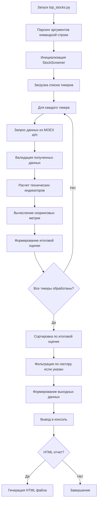

# 📊 Подробный алгоритм работы top_stocks.py - Оценщика акций

## 🔍 Общая схема работы



---

## 📥 Шаг 1: Получение данных из MOEX API

### 1.1 Формирование запроса
```python
url = f"https://iss.moex.com/iss/engines/stock/markets/shares/securities/{ticker}/candles.json"
params = {
    'from': start_date,  # Дата начала (30 дней назад)
    'till': end_date,     # Текущая дата
    'interval': 24,       # Дневные свечи
    'limit': 100          # Максимальное количество
}
```

### 1.2 Структура ответа MOEX
```json
{
    "candles": {
        "columns": ["open", "close", "high", "low", "value", "volume", "begin", "end"],
        "data": [
            [125.3, 126.5, 127.1, 124.8, 1000000, 8000, "2026-02-24 10:00:00", "2026-02-24 18:45:00"],
            ...
        ]
    }
}
```

### 1.3 Преобразование в DataFrame
```python
df = pd.DataFrame(candles, columns=columns)
df.rename(columns={'begin': 'time'}, inplace=True)
df.set_index('time', inplace=True)
# Оставляем только нужные колонки
df = df[['open', 'high', 'low', 'close', 'volume']]
```

### 1.4 Валидация данных
Проверяется:
- Наличие всех необходимых колонок
- Отсутствие пропусков
- Корректность цен (high >= low)
- Отсутствие аномальных скачков

---

## 🧮 Шаг 2: Расчет технических индикаторов

Для каждой акции последовательно рассчитываются:

### 2.1 RSI (Relative Strength Index)

```python
def calculate_rsi(prices, period=14):
    """
    RSI = 100 - (100 / (1 + RS))
    где RS = средняя прибыль / средний убыток
    """
    # 1. Вычисляем изменения цен
    deltas = np.diff(prices)
    
    # 2. Разделяем на прибыли и убытки
    gains = deltas[deltas > 0]
    losses = -deltas[deltas < 0]
    
    # 3. Вычисляем средние
    avg_gain = np.mean(gains) if len(gains) > 0 else 0.0001
    avg_loss = np.mean(losses) if len(losses) > 0 else 0.0001
    
    # 4. Вычисляем RS и RSI
    rs = avg_gain / avg_loss
    rsi = 100 - (100 / (1 + rs))
    
    return rsi
```

**Интерпретация:**
- **< 30** - перепроданность (сигнал к покупке)
- **30-70** - нейтральная зона
- **> 70** - перекупленность (сигнал к продаже)

### 2.2 MACD (Moving Average Convergence Divergence)

```python
def calculate_macd(prices, fast=12, slow=26, signal=9):
    # 1. Вычисляем быструю и медленную EMA
    ema_fast = calculate_ema(prices, fast)
    ema_slow = calculate_ema(prices, slow)
    
    # 2. MACD линия = быстрая EMA - медленная EMA
    macd_line = ema_fast - ema_slow
    
    # 3. Сигнальная линия = EMA от MACD линии
    signal_line = calculate_ema(macd_line, signal)
    
    # 4. Гистограмма = MACD линия - сигнальная линия
    histogram = macd_line - signal_line
    
    return macd_line[-1], signal_line[-1], histogram[-1]
```

**Интерпретация:**
- **Гистограмма > 0** - бычий сигнал
- **Гистограмма < 0** - медвежий сигнал

### 2.3 Скользящие средние (SMA)

```python
# SMA 20 - краткосрочный тренд
sma_20 = calculate_sma(closes, 20)

# SMA 50 - долгосрочный тренд  
sma_50 = calculate_sma(closes, 50)
```

### 2.4 Полосы Боллинджера (Bollinger Bands)

```python
def calculate_bollinger_bands(prices, period=20, num_std=2):
    # 1. Средняя линия = SMA 20
    middle = calculate_sma(prices, period)[-1]
    
    # 2. Стандартное отклонение за период
    std = np.std(prices[-period:])
    
    # 3. Верхняя полоса = средняя + (k * стандартное отклонение)
    upper = middle + (std * num_std)
    
    # 4. Нижняя полоса = средняя - (k * стандартное отклонение)
    lower = middle - (std * num_std)
    
    return upper, middle, lower

# Позиция в полосах (0-1)
bb_position = (current_price - lower) / (upper - lower)
```

**Интерпретация позиции:**
- **< 0.2** - у нижней границы (перепродано)
- **0.2-0.8** - в середине (нейтрально)
- **> 0.8** - у верхней границы (перекуплено)

### 2.5 ATR (Average True Range)

```python
def calculate_atr(high, low, close, period=14):
    # 1. Истинный диапазон для каждого дня
    tr1 = high[1:] - low[1:]              # High - Low
    tr2 = np.abs(high[1:] - close[:-1])   # High - previous close
    tr3 = np.abs(low[1:] - close[:-1])    # Low - previous close
    
    # 2. Максимальный из трех вариантов
    tr = np.maximum(np.maximum(tr1, tr2), tr3)
    
    # 3. Среднее за период
    atr = np.mean(tr[-period:])
    
    # 4. ATR в процентах от цены
    atr_percent = (atr / current_price) * 100
    
    return atr, atr_percent
```

**Интерпретация ATR%:**
- **< 1%** - низкая волатильность
- **1-2%** - средняя волатильность
- **2-3%** - повышенная волатильность
- **> 3%** - высокая волатильность

---

## 📊 Шаг 3: Определение трендов

### 3.1 Краткосрочный тренд (5 дней)
```python
sma_5 = np.mean(closes[-5:])
if current_price > sma_5:
    trend_short = "up"     # Цена выше среднего за 5 дней
elif current_price < sma_5:
    trend_short = "down"   # Цена ниже среднего за 5 дней
else:
    trend_short = "neutral"
```

### 3.2 Среднесрочный тренд (относительно SMA 20)
```python
if current_price > sma_20 * 1.02:    # На 2% выше SMA 20
    trend_medium = "up"
elif current_price < sma_20 * 0.98:  # На 2% ниже SMA 20
    trend_medium = "down"
else:
    trend_medium = "neutral"
```

### 3.3 Долгосрочный тренд (относительно SMA 50)
```python
if current_price > sma_50 * 1.05:    # На 5% выше SMA 50
    trend_long = "up"
elif current_price < sma_50 * 0.95:  # На 5% ниже SMA 50
    trend_long = "down"
else:
    trend_long = "neutral"
```

---

## 📈 Шаг 4: Вычисление скоринговых метрик

### 4.1 Momentum Score (-1 до 1)

Состоит из трех компонентов:

```python
# RSI компонент (40% веса)
if rsi < 30:        momentum_rsi = 1.0   # Сильная перепроданность
elif rsi < 40:      momentum_rsi = 0.7   # Легкая перепроданность
elif rsi < 50:      momentum_rsi = 0.3   # Ниже нейтрали
elif rsi < 60:      momentum_rsi = 0.0   # Нейтрально
elif rsi < 70:      momentum_rsi = -0.3  # Выше нейтрали
else:               momentum_rsi = -1.0  # Перекупленность

# MACD компонент (30% веса)
momentum_macd = 1.0 if macd_histogram > 0 else -1.0

# Bollinger Bands компонент (30% веса)
if bb_position < 0.1:   momentum_bb = 1.0   # Сильно у нижней границы
elif bb_position < 0.3: momentum_bb = 0.5   # Близко к нижней
elif bb_position < 0.7: momentum_bb = 0.0   # В середине
elif bb_position < 0.9: momentum_bb = -0.5  # Близко к верхней
else:                   momentum_bb = -1.0  # У верхней границы

# Итоговый momentum score
momentum_score = (momentum_rsi * 0.4 + momentum_macd * 0.3 + momentum_bb * 0.3)
```

### 4.2 Trend Score (-1 до 1)

```python
# Преобразуем тренды в числа
trend_map = {'up': 1, 'neutral': 0, 'down': -1}

trend_short_score = trend_map[trend_short]
trend_medium_score = trend_map[trend_medium]
trend_long_score = trend_map[trend_long]

# Взвешенная сумма (больший вес у долгосрочного тренда)
trend_score = (trend_short_score * 0.3 + 
               trend_medium_score * 0.3 + 
               trend_long_score * 0.4)
```

### 4.3 Volume Score (0 до 1)

```python
avg_volume = np.mean(volumes[-10:])  # Средний объем за 10 дней
volume_ratio = current_volume / avg_volume

if volume_ratio > 1.5:
    volume_score = 1.0    # Объем на 50% выше среднего
elif volume_ratio > 1.2:
    volume_score = 0.7    # Объем на 20% выше среднего
elif volume_ratio > 0.8:
    volume_score = 0.3    # Объем около среднего
else:
    volume_score = 0.0    # Объем ниже среднего
```

### 4.4 Volatility Score (0 до 1)

```python
# Чем ниже волатильность, тем лучше для входа
if atr_percent < 1.0:
    volatility_score = 1.0    # Очень низкая волатильность
elif atr_percent < 2.0:
    volatility_score = 0.7    # Низкая волатильность
elif atr_percent < 3.0:
    volatility_score = 0.3    # Средняя волатильность
else:
    volatility_score = 0.0    # Высокая волатильность
```

---

## 🎯 Шаг 5: Итоговая оценка (Total Score)

### 5.1 Веса компонентов
```python
weights = {
    'momentum': 0.35,   # 35% - импульс движения
    'trend': 0.30,      # 30% - тренд
    'volume': 0.20,     # 20% - объем торгов
    'volatility': 0.15  # 15% - волатильность
}
```

### 5.2 Нормализация и взвешивание
```python
# Momentum и Trend от -1 до 1 -> преобразуем в 0-100
momentum_norm = (momentum_score + 1) / 2 * 100
trend_norm = (trend_score + 1) / 2 * 100

# Volume и Volatility уже от 0 до 1 -> просто умножаем на 100
volume_norm = volume_score * 100
volatility_norm = volatility_score * 100

# Итоговая оценка
total_score = (
    momentum_norm * weights['momentum'] +
    trend_norm * weights['trend'] +
    volume_norm * weights['volume'] +
    volatility_norm * weights['volatility']
)

# Ограничиваем от 0 до 100
total_score = max(0, min(100, total_score))
```

### 5.3 Рекомендация на основе оценки

| Оценка | Рекомендация | Действие |
|--------|--------------|----------|
| 80-100 | **STRONG_BUY** | Сильная покупка, агрессивный вход |
| 65-79 | **BUY** | Покупка, можно входить |
| 40-64 | **HOLD** | Держать, не входить |
| 20-39 | **SELL** | Продажа, выход из позиции |
| 0-19 | **STRONG_SELL** | Сильная продажа, срочный выход |

---

## 🔄 Шаг 6: Подбор акций под стратегии

### 6.1 Для SMA Crossover (трендовая)
```python
criteria = [
    price > sma_50,           # Цена выше долгосрочного тренда
    volume_score > 0.5,       # Хороший объем
    rsi < 65,                  # Не перекуплена
    trend_long == "up"         # Восходящий тренд
]
```

### 6.2 Для RSI Mean Reversion (возврат к среднему)
```python
criteria = [
    rsi < 35,                  # Перепродана
    bb_position < 0.3,         # У нижней полосы
    atr_percent < 3.0          # Не слишком волатильна
]
```

### 6.3 Для Momentum (сильные движения)
```python
criteria = [
    momentum_score > 0.5,      # Сильный импульс
    trend_long == "up",        # Восходящий тренд
    volume_score > 0.7         # Растущие объемы
]
```

### 6.4 Для Value (стоимостные)
```python
criteria = [
    rsi < 40,                  # Низкий RSI
    atr_percent < 2.0,         # Низкая волатильность
    trend_long == "down"       # Нисходящий тренд (дно)
]
```

### 6.5 Для Pair Trading (парный трейдинг)
```python
# Ищем пары внутри одного сектора
# Сортируем по RSI и берем самую перепроданную и перекупленную
stocks_by_rsi = sorted(sector_stocks, key=lambda x: x.rsi)
pair = (stocks_by_rsi[0].ticker, stocks_by_rsi[-1].ticker)
rsi_spread = stocks_by_rsi[-1].rsi - stocks_by_rsi[0].rsi
```

---

## 📤 Шаг 7: Формирование выходных данных

### 7.1 Консольный вывод (ConsoleReporter)

```python
def print_top_stocks(scores, title="ТОП АКЦИЙ ДЛЯ ПОКУПКИ"):
    """
    Форматированный вывод в виде таблицы
    Использует библиотеку tabulate
    """
    table_data = []
    for i, score in enumerate(scores[:10], 1):
        table_data.append([
            i,
            score.ticker,
            score.name[:20],
            f"{score.price:.2f} ₽",
            f"{score.rsi:.1f}",
            score.trend_long.upper(),
            f"{score.atr_percent:.1f}%",
            f"{score.total_score:.1f}",
            f"{emoji} {score.recommendation}"
        ])
    
    print(tabulate(table_data, headers=headers, tablefmt='grid'))
```

### 7.2 HTML отчет (HTMLReporter)

```python
def generate_html_report(scores, filename="stock_report.html"):
    """
    Генерирует HTML страницу с таблицей и стилями
    """
    html = f"""
    <!DOCTYPE html>
    <html>
    <head>
        <title>Анализ акций</title>
        <style>
            .STRONG_BUY {{ background-color: #00ff00; }}
            .BUY {{ background-color: #90ff90; }}
            .HOLD {{ background-color: #ffff90; }}
        </style>
    </head>
    <body>
        <h1>📊 Анализ акций</h1>
        <table>
            <tr>
                <th>#</th>
                <th>Тикер</th>
                <th>Компания</th>
                <th>Сектор</th>
                <th>Оценка</th>
                <th>Рекомендация</th>
            </tr>
            {rows}
        </table>
    </body>
    </html>
    """
```

---

## 🎯 Пример полного цикла работы

### Входные данные
```bash
python top_stocks.py --top 5 --html --sector IT
```

### Пошаговый процесс

1. **Парсинг аргументов:**
   - top=5
   - html=True
   - sector="IT"

2. **Загрузка данных для IT сектора:**
   - YDEX (Яндекс)
   - VKCO (VK)
   - MTSS (МТС)
   - POSI (Positive Technologies)
   - HEAD (HeadHunter)

3. **Расчет для YDEX:**
   - RSI = 32.1 (перепродана)
   - MACD гистограмма = 0.5 (бычий сигнал)
   - BB позиция = 0.25 (близко к низу)
   - ATR% = 1.5% (средняя волатильность)
   - Momentum score = 0.6
   - Trend score = 0.3
   - Total score = 78.5 → **BUY**

4. **Сортировка:**
   1. YDEX - 78.5 (BUY)
   2. HEAD - 72.3 (BUY)
   3. MTSS - 65.1 (BUY)
   4. VKCO - 58.2 (HOLD)
   5. POSI - 45.7 (HOLD)

5. **Вывод:**
   - Топ-5 акций IT сектора
   - Рекомендации по стратегиям
   - HTML отчет сохранен

---

## 📊 Визуальное представление алгоритма

```
┌─────────────────────────────────────────────────────────────┐
│                      top_stocks.py                           │
├─────────────────────────────────────────────────────────────┤
│                                                              │
│  ┌─────────────┐    ┌─────────────┐    ┌─────────────┐     │
│  │  Парсинг    │    │   Загрузка  │    │  Валидация  │     │
│  │  аргументов │───▶│    данных   │───▶│    данных   │     │
│  └─────────────┘    └─────────────┘    └─────────────┘     │
│                           │                                  │
│                           ▼                                  │
│  ┌───────────────────────────────────────────────────┐     │
│  │            Расчет индикаторов                      │     │
│  │  ┌────────┐ ┌────────┐ ┌────────┐ ┌────────┐    │     │
│  │  │  RSI   │ │  MACD  │ │   BB   │ │  ATR   │    │     │
│  │  └────────┘ └────────┘ └────────┘ └────────┘    │     │
│  └───────────────────────────────────────────────────┘     │
│                           │                                  │
│                           ▼                                  │
│  ┌───────────────────────────────────────────────────┐     │
│  │              Скоринг и ранжирование                │     │
│  │  ┌────────────┐ ┌────────────┐ ┌────────────┐    │     │
│  │  │  Momentum  │ │   Trend    │ │  Volume    │    │     │
│  │  │   Score    │ │   Score    │ │   Score    │    │     │
│  │  └────────────┘ └────────────┘ └────────────┘    │     │
│  │                   ┌────────────┐                  │     │
│  │                   │ Volatility │                  │     │
│  │                   │   Score    │                  │     │
│  │                   └────────────┘                  │     │
│  └───────────────────────────────────────────────────┘     │
│                           │                                  │
│                           ▼                                  │
│  ┌─────────────┐    ┌─────────────┐    ┌─────────────┐     │
│  │    Топ      │    │  Подбор под │    │   Отчеты    │     │
│  │   акций     │───▶│  стратегии  │───▶│ (консоль,   │     │
│  │             │    │             │    │   HTML)     │     │
│  └─────────────┘    └─────────────┘    └─────────────┘     │
│                                                              │
└─────────────────────────────────────────────────────────────┘
```

---

## 🎯 Ключевые особенности алгоритма

1. **Многофакторность** - учитывает 4 различных аспекта (momentum, trend, volume, volatility)
2. **Адаптивность** - веса можно менять под разные рыночные условия
3. **Проверка качества** - валидация данных на каждом этапе
4. **Прозрачность** - каждый компонент оценки можно отследить
5. **Расширяемость** - легко добавить новые метрики

Алгоритм обеспечивает комплексную оценку акций, учитывая как технические индикаторы, так и рыночные метрики, что позволяет принимать обоснованные инвестиционные решения.